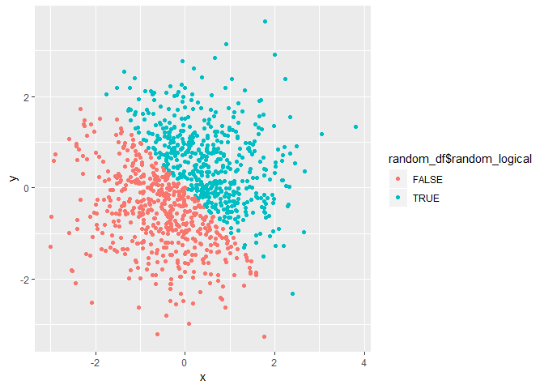
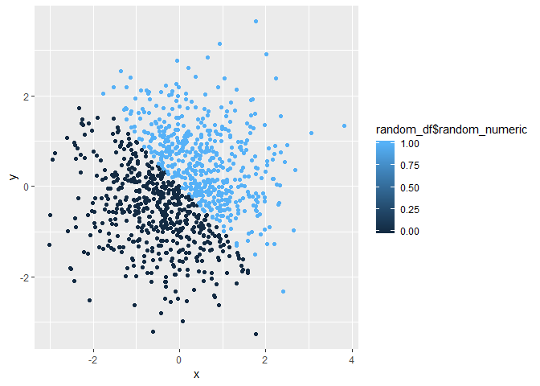
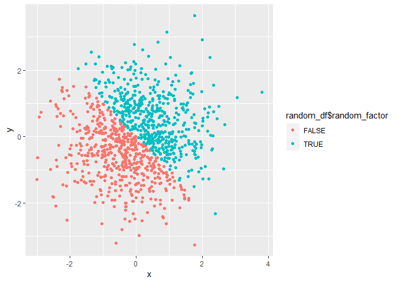

p8105\_HW1\_ntk2109\_markdown
================
Noah Kreski

1A. Question One, vectors
-------------------------

Problem 1 - Creating a data frame comprised of:

A random sample of size 10 from a uniform \[0,5\] distribution

A logical vector indicating whether elements of the sample are greater than 2

A (length-10) character vector

A (length-10) factor vector

``` r
#using data frame to establish vectors
set.seed(1)

question_one_df = tibble(
  uniform_samp = runif(10, 0, 5),
  logical_vec_one = c((uniform_samp)>2),
  character_vec_one = c("This", "is", "a", "character", "vector", "that", "has", "length", "of", "ten"),
  factor_vec_one = factor(c("male", "female","male", "female","male", "female","male", "female","male", "female")
))
```

The mean of the random sample is 2.7575694.

The mean of the logical vector is 0.6.

The mean of the character vector is NA.

The mean of the factor vector is NA.

For the random sample and logical vector, means were produced. For the character vector and factor vector, no means were produced.

B. Conversion to numeric
------------------------

``` r
#creating data frame to convert previous vectors to numeric
question_one_numeric_df = tibble(
  logical_vec_one_numeric = as.numeric(question_one_df$logical_vec_one),
  character_vec_one_numeric = as.numeric(question_one_df$character_vec_one),
  factor_vec_one_numeric =  as.numeric(question_one_df$factor_vec_one)
)
```

The new mean of the logical vector is 0.6.

The new mean of the character vector is NA.

The new mean of the factor vector is 1.5.

Now, both the logical and factor vectors produce mean values, whereas the character vector is incapable of being converted this way.

C. Double conversion of factor and character vectors
----------------------------------------------------

``` r
#creating data frame for double conversion
double_conversion_df = tibble(
  character_vec_one_double = as.numeric(factor(c(question_one_df$character_vec_one))),
  factor_vec_one_double =  as.numeric(as.character(question_one_df$factor_vec_one))
)
```

The new mean of the character vector is 5.5.

The new mean of the factor vector is NA.

It appears that converting from a character vector to a factor vector to a numeric one will allow for the computation of a mean, but converting from factor to character to numeric produces issues, just as seen in part b when converting from character to numeric.

2A. Data Frame for random sample, description of vector
-------------------------------------------------------

Creating a data frame comprised of:

x: a random sample of size 1000 from a standard Normal distribution

y: a random sample of size 1000 from a standard Normal distribution

A logical vector indicating whether the x + y &gt; 0

A numeric vector created by coercing the above logical vector

A factor vector created by coercing the above logical vector

``` r
#creating data frame for x,y,and related vectors
set.seed(1)
random_df = tibble(
  x = rnorm(1000),
  y = rnorm(1000),
  random_logical = c((x+y)>0),
  random_numeric = as.numeric(random_logical),
  random_factor =factor(c(random_logical))
)
```

The above code produces vectors with the following characteristics:

The size of the data set is 1000 observations with 5 variables for each.

The mean of x is -0.0116481 and the median is -0.0353242.

The proportion of cases for which the logical vector is true is 0.49.

B. Scatterplots
---------------

Scatterplots of y vs x

``` r
#creating scatterplots with data frame vectors for x, y, and color

ggplot(random_df, aes(x=x,y=y, color = random_df$random_logical)) +geom_point()
```



``` r
ggsave("HW1Scatterplot.pdf")


ggplot(random_df, aes(x=x,y=y, color = random_df$random_numeric)) +geom_point()
```



``` r
ggplot(random_df, aes(x=x,y=y, color = random_df$random_factor)) +geom_point()
```



The color schemes for the logical and factor scatterplots is identical, using two categories of True and False either as logical statements or factors, but the numeric scatterplot has instead a scale between the maximum and minimum values, even though all values are 1 or 0.
